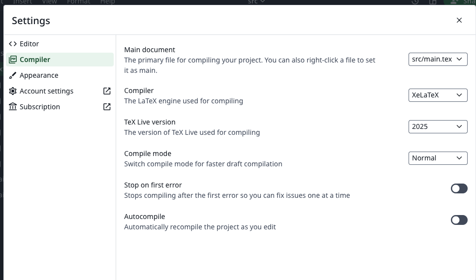
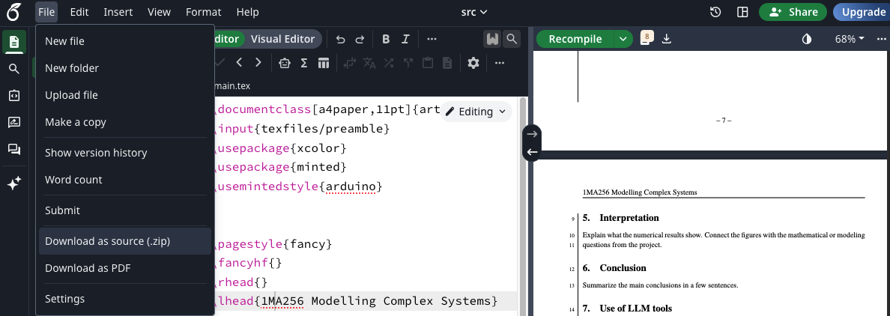

# MOCS — Modelling of Complex Systems VT26

Repository for group work in **Modelling of Complex Systems (VT26)**

This repository contains:

* Reports (LaTeX)
* Code implementations
* Figures and results

---

# Repository Structure

```
MOCS/
│
├── aux/ For README.md 
├── reports/
├── code/
├── shared/
└── README.md
```

* `reports/` → LaTeX reports
* `code/` → simulation / analysis code
* `figures/` → generated plots
* `shared/` → common resources

---

# First-Time Setup (macOS / Linux)

Check if git is installed

```
git --version
```

If not installed:

* macOS: Install Xcode Command Line Tools

```
xcode-select --install
```

* Ubuntu/Debian:

```
sudo apt install git
```

---

# SSH Setup (Recommended)

Generate SSH key

```
ssh-keygen -t ed25519 -C "your_email@example.com"
```

Start ssh agent

```
eval "$(ssh-agent -s)"
```

Add key

```
ssh-add ~/.ssh/id_ed25519
```

Copy public key

```
cat ~/.ssh/id_ed25519.pub
```

Add the key to GitHub:

https://github.com/settings/keys

---

# Clone Repository

Use SSH

```
git clone git@github.com:dragonesk22/MOCS.git
```

Enter folder

```
cd MOCS
```

---

# Daily Workflow

Before starting work

```
git pull
```

After making changes

```
git add .
git commit -m "Short description of changes"
git push
```

---

# Commit Message Examples

Good

```
Add deadlock example
Fix report typos
Add plotting script
```

Avoid

```
update
stuff
fix
```

---

# Overleaf Preview
The project looks roughly like this:
```
├── README.md
├── code
│   └── L1
├── reports
│   └── L1
│       ├── out
│       ├── src
│       └── src.zip
└── shared

```
Notice that 'reports' contain a src and out folder. If you zip the src folder, you can upload it to Overleaf and have it automatically compile. But then you need to have the following settings:


### Working "locally" on Overleaf and uploading to GitHub
1. Open the project in Overleaf, then download it as a zip file.

2. Go to where you cloned the repository on your computer

    (i.e. where you did ``git clone https://github.com/dragonesk22/MOCS.git``)
3. Replace old ``/reports/L1/src`` with the new (unzipped) ``src``directory.
4. Commit and push to GitHub via
```
git add .
git commit -m "Update reports"
git push
```
5. Also if you only made changes to one .tex file, you can just commit and push that file after replacing the old one with the new latest one in Overleaf.

6. Another method could be to go directly to GitHub https://github.com/dragonesk22/MOCS/tree/main/reports/L1/src/texfiles 
 and upload the new .tex file via click onf "Add file -> Upload files -> Choose file (with the same name)"
7. Or just post the file in the WhatsApp group and who can can upload it on GitHub.
---
